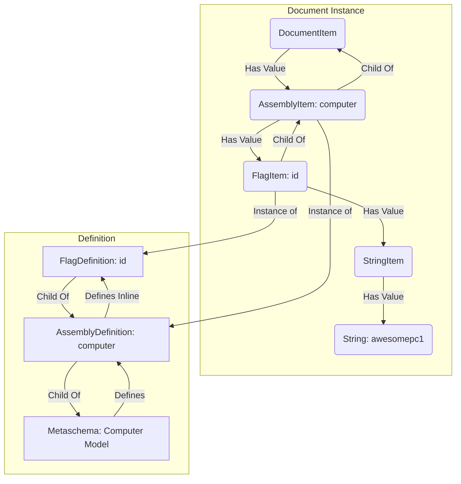

# Document Instance Design

Date: 2022-12-29

## Status

Proposed

## Context

In order for the Node implementation of Metaschema to reach "type 2" status, it must have the capability to read document instances of a Metaschema.
The design of the document instance classes influences how downstream projects will consume a metaschema, and how constraint validation will happen internally.

The Java implementation ([`metaschema-java`](https://github.com/usnistgov/metaschema-java)) uses a binding parser design, where definition-specific classes are generated for each Metaschema at compile time for some package (such as `liboscal-java`).

## Decision

The Node implementation has potential use-cases such as on-the-fly validation and visualization which would make a binding parser impractical.
Additionally, the lack of XML pull-parsers in the Node ecosystem makes a binding parser design impractical to support in the short term.
The implementation should be tailored for a DOM-based design, while remaining flexible enough to allow for binding-parser designs further down the road for performant applications.

The Node implementation will handle document instances using the following structures:

-   `Item`: An `Item` is some fragment of a Document Instance of some Metaschema.
    `Items` could be as small as a single string, a field, or even the whole document instance.

    `Items` are derived from the [`ICustomJavaDataType`](https://github.com/usnistgov/metaschema-java/blob/main/metaschema-model-common/src/main/java/gov/nist/secauto/metaschema/model/common/datatype/ICustomJavaDataType.java) and [`IItem`](https://github.com/usnistgov/metaschema-java/blob/main/metaschema-model-common/src/main/java/gov/nist/secauto/metaschema/model/common/metapath/item/IItem.java) interfaces from the Java implementation, **with some crucial differences**.

    First, `Items` always have a `value`, and that value is either some primitive such as a string, or another `Item` (for example a field item containing a string item inside of it).

    Second, `Items` have a very different hierarchy from the Java implementation. The current `Item` hierarchy looks like this:

    ```mermaid
    classDiagram
        direction TD
        class Item{
            <<abstract>>
            value
        }
        class AtomicItem{
            <<abstract>>
        }
        class NodeItem{
            <<abstract>>
            NodeItem|DocumentItem parent
            Definition definition
            Instance|undefined instance
            registerParent()
        }
        class ModelNodeItem{
            <<abstract>>
            flags
            getFlag(name)
        }
        %% Define inheritance structure
        AtomicItem --|> Item
        NodeItem --|> Item
        DocumentItem --|> Item
        FlagItem --|> NodeItem
        ModelNodeItem --|> NodeItem
        AssemblyItem --|> ModelNodeItem
        FieldItem --|> ModelNodeItem
        %% Define links
        DocumentItem "1" --> "*" NodeItem: Parent
        NodeItem "1" ..> "*" NodeItem: Parent
        ModelNodeItem "1" --> "*" FlagItem: Has Flag
    ```

    `Items` within a document instance are constructed bottom up (start with the leafs of the document), however the `registerParent()` method of the `NodeItem` subclass allows children to have knowledge of their parent, which will be important for validation in the future.

    All datatypes (strings, URIs, markup, etc.) are derived from the `AtomicItem` subclass.
    Atomic items do not need knowledge of their parents, since constraints belong to the Fields, Flags, and Assemblies which contain them.

-   `Serializer`: `Serializers` have a few jobs:

    1. Serializing `Items` to/from JSON/XML/etc.
    1. Providing information about the parsing behavior of a datatype

    Some serializers are simple and can essentially be treated as singletons, such as a serializer that creates a `StringItem`.
    However serializers for model objects like an **Assembly** will have to be constructed on a per-definition/instance basis.

    `Serializers` are derived from the [`IDataTypeAdapter`](https://github.com/usnistgov/metaschema-java/blob/main/metaschema-model-common/src/main/java/gov/nist/secauto/metaschema/model/common/datatype/IDataTypeAdapter.java) interface of the Java implementation.
    `Serializers` are much simpler however as they do not currently handle operations like constructing new items, casting between items, and copying items.

-   `Providers`: A `Provider`'s job is to associate a `Serializer` with some name.
    For example, a provider could be in charge of associating atomic datatypes with their associated `Serializer` (`string` -> `StringSerializer`), or a `Provider` could be in charge of associating an **Assembly**'s formal name with a `Serializer` built to parse that assembly type.

    `Providers` are similar in spirit to the [`IDataTypeProvider`](https://github.com/usnistgov/metaschema-java/blob/main/metaschema-model-common/src/main/java/gov/nist/secauto/metaschema/model/common/datatype/IDataTypeProvider.java) interface of the Java implementation.

The relationship between these components can be summarized as follows:


The sequence for parsing a Metaschema Document Instance would be as follows:

1. The Metaschema definition(s) are loaded
2. A provider for all the defined Assemblies, Fields, and Flags is constructed
3. Given a document instance, the Root Assembly's associated serializer is called
4. The serializer constructs the root item, parsing the entire tree.

This design can be amended to pull items from the tree as requested.

### Full Example

Given a simple Metaschema definition (pulled from the Metaschema Tutorials):

<!-- TODO: Add a link to the tutorial once it is published -->

```xml
<METASCHEMA xmlns="http://csrc.nist.gov/ns/oscal/metaschema/1.0">
  <schema-name>Computer Model</schema-name>
  <schema-version>0.0.2</schema-version>
  <short-name>computer</short-name>
  <namespace>http://example.com/ns/computer</namespace>
  <json-base-uri>http://example.com/ns/computer</json-base-uri>
  <define-assembly name="computer">
    <formal-name>Computer Assembly</formal-name>
    <description>A container object for a computer, its parts, and its sub-parts.</description>
    <root-name>computer</root-name>
    <define-flag name="id" as-type="string" required="yes">
        <formal-name>Computer Identifier</formal-name>
        <description>An identifier for classifying a unique make and model of computer.</description>
    </define-flag>
  </define-assembly>
</METASCHEMA>
```

And a simple document instance of this Metaschema definition:

```yaml
---
computer:
    id: awesomepc1
```

The proposed design would load the document instance into the following rough structure:



## Consequences

This design will inform the design of the metapath engine, constraint validation, and code generation pieces.
